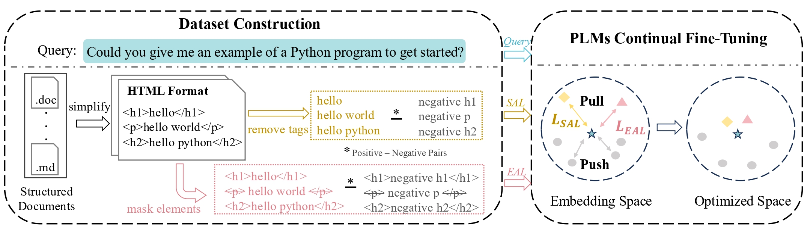

<h1>SEAL</h1>
<h3>
SEAL: Structure and Element Aware Learning Improves Long Structured Document Retrieval
<h3>

    

<h1>StructDocRetrieval</h1>

| Split       | Query   | Doc.    | Avg. Words Query | Avg. Words Doc. |
|-------------|---------|---------|------------------|-----------------|
| **Train**   | 23,816  | 23,816  | 12.82            | 10,849          |
| **Test**    | 3,404   | 3,404   | 13.04            | 10,535          |
| **Evaluation** | 6,804  | 6,804   | 12.74            | 11,047          |

*Note:* The "Avg. Words" represents the average number of words in queries and documents.
